# 关于太阳系的运动研究
  — The solar system

---

### 快速导航：
  1. [目的](#目的)
  2. [使用环境](#使用环境)
  3. [步骤及内容](#步骤及内容)
    1. [通过 Euler-Cromer 方法计算行星轨迹](#一通过-euler-cromer-方法计算行星轨迹)
    2. [验证 KEPLER 第二定律](#二验证-kepler-第二定律)
    3. [从万有引力出发考虑天体运动](#三从万有引力出发考虑天体运动)
  4. [总结](#总结)

---

## 目的：

  * 通过《计算物理（第二版）》课本的第4章上给出的`推导公式`和一些`伪算法`，写出程序
  * 计算太阳系中天体运动轨迹、速度、和其它的参数。
  * 验证 KEPLER 三大定律等等。
  * 探究太阳系的运动规律。

## 使用环境：

  * 操作系统：  Windows 7 64 bit
  * 编程语言：  Java 1.7.0_80
  * IDE版本：   Eclipse Mars.2 Release JDK 7
 
## 步骤及内容：

### 一、通过 Euler-Cromer 方法计算行星轨迹

仿真时，设置 solar 中心为太阳，地球的初始位置是在 （1, 0）这个点，初始速度是 Vx = 0, Vy = 2π AU/yr， time step 设置为0.002 yr。
地球围绕着太阳的轨迹如下图

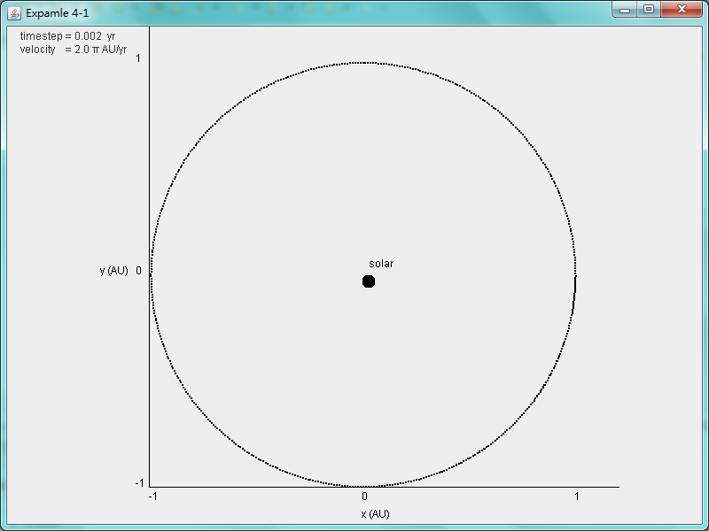

图1  time step = 0.002  v = 2π

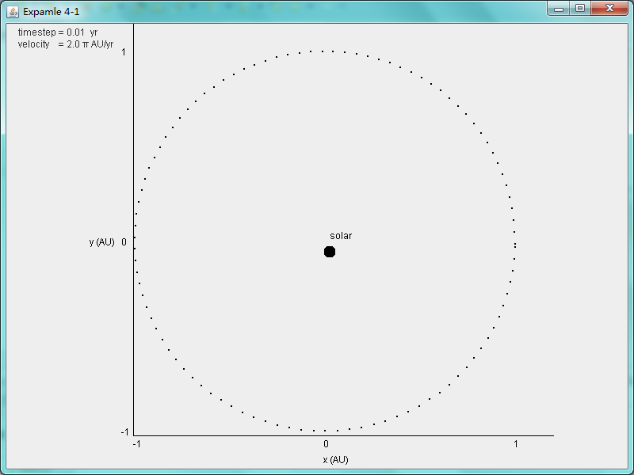

图2  time step = 0.01  v = 2π

可以看到，当参数设置成上述初始参数时，地球围绕太阳所作的运动轨道轨迹十分像一个圆。 但是从打印的数据中可以看到（表1），

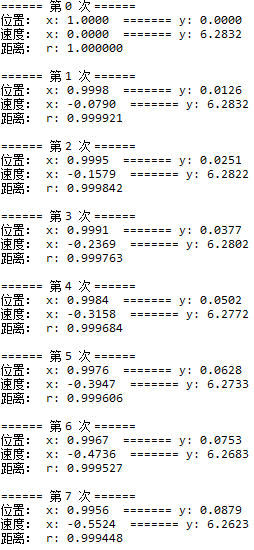

**地球到太阳的距离 r 并不是完全不变的，但是这个变化在 AU 为单位的条件下变化太小，每次变化的数值小于 0.0001**，
所以显示在图片上，感觉距离并没有什么变化。（完整的实验数据参考同目录下的文件“[实验数据1.txt](./实验数据1.txt)”）。

之后，将时间间隔设置成 0.01 yr 之后，当地球绕太阳转一圈时，轨迹是一系列孤立的点，当时当循环的次数足够多时，图2将变得和图1一样，十分平滑，说明了**时间间隔在一定的数值范围内对于 Euler-Cromer 方法计算得到的轨迹没有影响**。

但是**当时间间隔设置到足够大时，比如设置成 0.08 yr时 ，可以看到，地球的轨迹包络线已经从圆或者说椭圆变成了圆环**。
分析原因，当时间间隔取的比较大的时候，计算得到的速度和位置在圆环外环和圆环内环之间做椭圆运动，在这个轨迹里运动的时候，计算出的速度有可能超过2π，`经过足够长的时间后，轨迹的包络线就变成了圆环`（完整的实验数据参考同目录下的文件“[实验数据2.txt](./实验数据2.txt)”）。`地球的轨迹却是一个不停循环的螺旋线`。

但是按照 Euler-Cromer 方法计算得到的速度和位置不应该出现类似图3的情况。下面分析 Euler-Cromer 方法的算法步骤。
下面四个公式是计算每经过一个时间间隔之后，地球的位置和速度

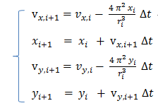

通过公式可以看到，由于 v(x,i+1) 本质上是第 i+1 时刻的速率，当 ∆t 大于一定的值的时候，造成相应的  比较大，那么就相当于**太阳对地球的引力非常大，也就是加速度非常大**，这样导致的结果就是在某个时刻，
地球的速度方向变化的很大，这个时候地球的运动就变成了螺旋状，导致轨迹的内环和外环之间相隔较远，经过足够长的时间最后看到的轨迹就成了一个（椭）圆环。
如下面三幅图

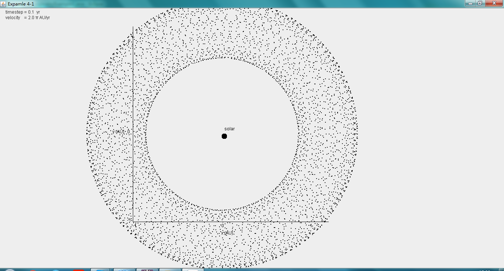

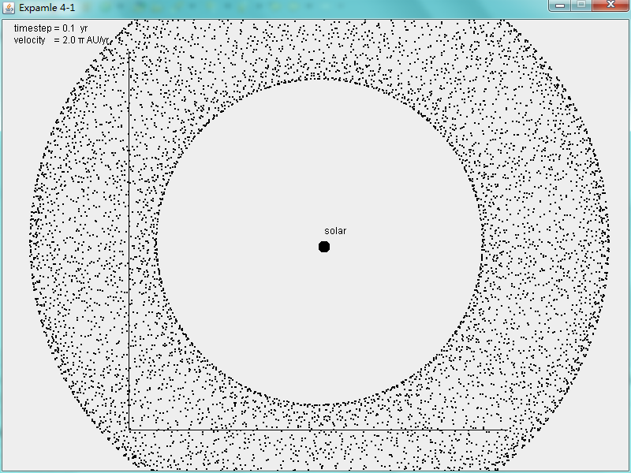

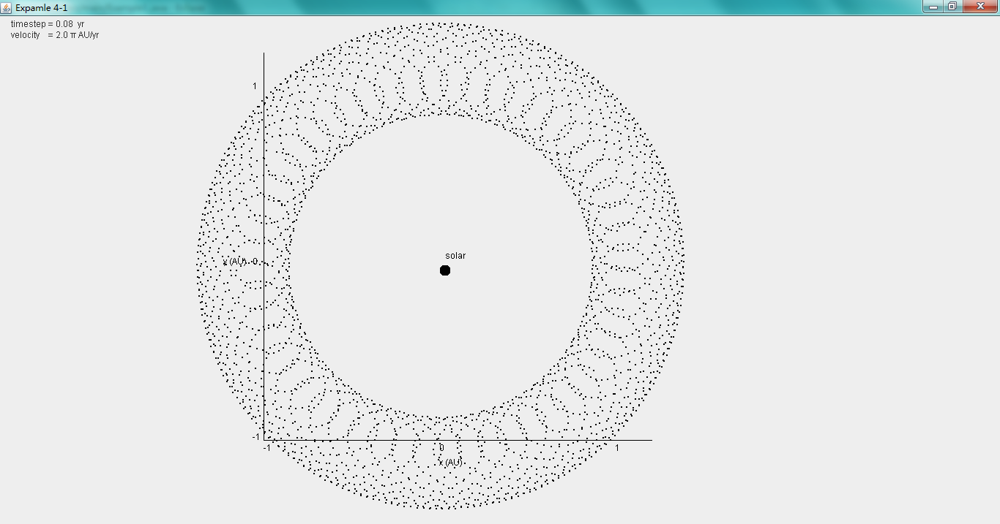
  
另外，通过设置地球的初速度为 1.3 AU / yr 时，

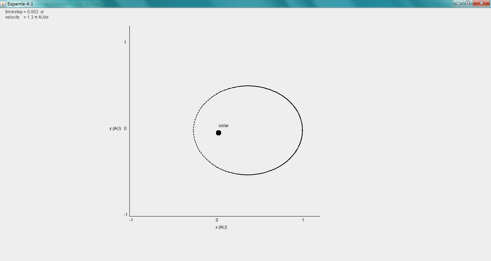

从图中可以看到，地球的运动轨迹明显不是一个圆，而是一个椭圆了，并且太阳的位置也不是在椭圆的中心，而是在椭圆内部一侧（应该在椭圆的一个焦点上）。

通过观察轨迹可以看出，地球在距离太阳较远的轨迹上运动时，线条颜色深，在距离太阳近的轨迹上运动时，线条颜色浅而且不连续，推测**地球在远日点附近的运动速度慢，所以绘制出的点多而且密集，在近日点附近的运动速度快，所以绘制的点少且稀疏。这与常识也是相对应的**。
用能量守恒的关系解释就是地球的势能和动能在围绕太阳运动的过程中相互转化。
当初始速度设置为2.3 AU / yr 时，地球的轨迹变成了一个大的椭圆，太阳位于椭圆的另一个焦点上（见下图)

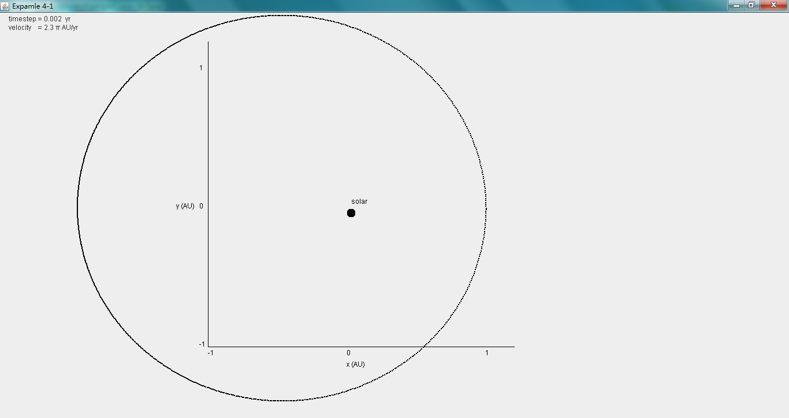

并且地球的运动速度和位置的关系也是正确的。

### 二、验证 KEPLER 第二定律

首先，在相同的时间内，行星与太阳连线扫过的面积相等,即验证了 KEPLER 第二定律。设置两次时间间隔
均为 `100 x 0.002 = 0.2 yr`,计算得到的区域像素点来得到面积。

由于计算面积的算法不是很完善，而在轨迹上运动的点的像素是否计算在内等问题，如果**两次得到的面积相差的误差在 2% 以内，则认为两个时间间隔内，连线扫过的面积相等**。
  
#### 计算扫过的面积：

由于使用程序绘图，所以在轨迹在图形上其实是有非常严重的锯齿的。这个时候计算面积无法简单的按照轨迹上各个点到太阳的连线所扫过的像素来计算，因此，在时间间隔内的起始时间和终止时间对应的点和太阳的连线，再与这段时间间隔内在轨迹上对应的各个点，连接而成的封闭的曲线，
然后**计算在这个封闭曲线内的所以像素的和，即等效于我们需要的面积**。

同时，由于程序绘制轨迹的时候，（轨迹是由一个个孤立但是相隔很近的点组成），像素点的位置是向右下角偏移的，所以仔细观察图形会发现，**有时候扫过的区域会超出轨迹**，这属于正常的现象，这可以通过`改进绘图方法`或`提高绘图分辨率`来修正这个问题。

#### 计算扫过面积的算法：

首先，计算一定时间间隔内在轨迹上的所有点的横纵坐标，然后，通过函数找到这些点中的横坐标和纵坐标最大的值以及最小的值。这四个值实际上构成一个矩形。 
然后扫描屏幕上所有的点，** 如果某一点到原点的距离小于1，并且这个点的横坐标在之前求得的最大最小值之间，纵坐标也在最大最小值之间，那么就认为这个点应该被算作面积里面 **（实际绘图的程序有个 `SIZE` 来进行适当的缩放）。
通过循环得到所有在围线内的点，累加后得到面积。

#### 改进算法：

由于实际的轨迹是个椭圆，使用初值条件计算时得到的 x 范围在 [-240, 240] 之间，(因为乘上了一个缩放因子 SIZE = 240)， y 的范围在 [ -241, 238] 之间，所以，计算x = 0 , y > 0 附近区域的时候，**由于算法的局限性，这部分面积没有包括在内**，（如图）。

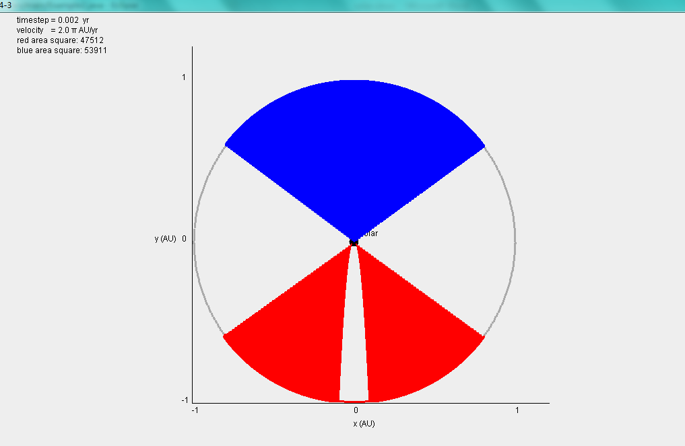

经过分析计算发现，这部分的 y < 240，所以需要在计算点的纵坐标的时候加上一个 `-1.5 的偏移`，保证本应计算在内的区域包含到计算中。

#### 实验数据：

第一次计算时间间隔分别取 200*0.002 ~ 300*0.002 即 0.4 ~ 0.6 和 300*0.002 ~ 400*0.002 即 0.6 ~ 0.8，
绘出图形 example2.1.png， 计算得到红色区域的面积为 `35536`，蓝色区域的面积为 `35519`，两者之间的误差在 17 / 35519 = `0.047%`，在误差允许的范围内，可以认为两者面积相等。
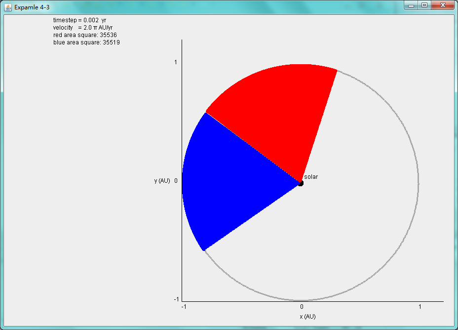

第二次计算时间间隔分别取 100*0.002 ~ 150*0.002 即 0.2 ~ 0.3 和 300*0.002 ~ 350*0.002 即 0.6 ~ 0.7，
绘出图形 example2.2.png， 计算得到红色区域的面积为 `17968`，蓝色区域的面积为 `17549`，两者之间的误差在 19 / 17549 = `0.10%`，在误差允许的范围内，可以认为两者面积相等。
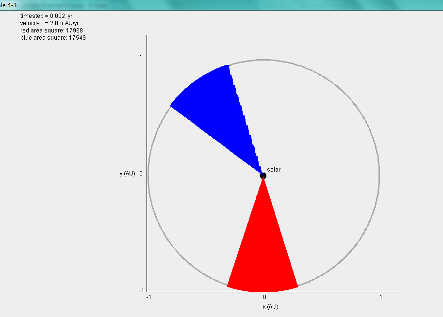

第三次计算时间间隔分别取 50*0.002 ~ 200*0.002 即 0.1 ~ 0.4 和 300*0.002 ~ 450*0.002 即 0.5 ~ 0.8，
绘出图形 example2.3.png， 计算得到红色区域的面积为 `54566`，蓝色区域的面积为 `53991`，两者之间的误差在 575 / 51129 = `1.06%`，在误差允许的范围内，可以认为两者面积相等。
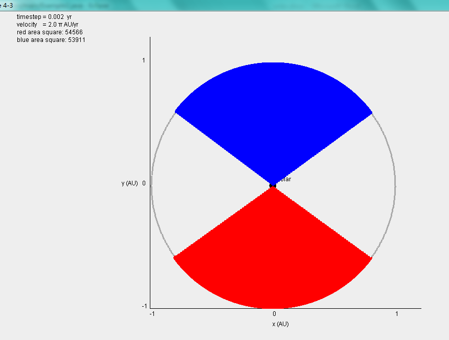

实验结果如下表所示。

速率为  v = 2π

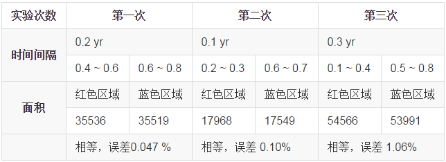

    综合表格数据， KEPLER 第二定律验证成功。同时，这也证明了，地球围绕太阳运行的轨道是椭圆。

### 三、从万有引力出发考虑天体运动

#### 分析：
  
在前两个步骤中，假设了太阳质量无穷大，因此太阳不会受到地球的万有引力影响而产生位移，但是实际问题中，太阳可能会因为引力的作用导致其一直在做一个半径很小的圆（椭圆）运动。

这里通过程序模拟两个天体之间的万有引力及加速度。初始条件为太阳位于原点，地球位于 (1,0) ，单位为 AU，地球初始速度为 2π AU / yr。计算太阳和地球的运动时，仍然将太阳和地球看作质点。不再使用 Euler-Cromer 方法计算地球的轨迹和速度，而是**考虑万有引力对地球加速度的影响**，进而影响速度和轨迹。万有引力同时也会影响太阳的运动。
程序源代码为 [Example3.java](./src/main/Example3.java)

#### 程序运行过程中出现的问题：

在第一次运行程序时，由于计算万有引力需要用到地球和太阳的质量，以及地球和太阳之间的距离，但是地球和太阳的质量使用的是 Kg 作为单位，而距离是以 AU 为天文单位，因此进行几次循环之后，程序就跑飞了，无法继续计算地球和太阳的轨迹。于是以地球的质量为单位质量，经过这样改进程序之后，先设置太阳的质量为100，地球的质量为1，但是观察图形可以看到，经过一段时间后，`地球距离太阳越来越远`，甚至跑出了程序绘制的图形中。

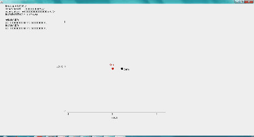

猜想这可能是由于太阳与地球的质量比并不是这么小，需要增大程序中的太阳质量。通过之前的太阳质量为 2 x 1030 kg 和地球的质量是 6 x 1024 kg，设太阳的质量为 3 x 105 单位质量。

运行程序，发现这个时候的地球运动轨迹仍然会逐渐远离太阳。但是当我把太阳的质量设置成非常非常大，大约为地球质量的 109 倍的时候，`地球不再是远离太阳，而是逐渐逼近太阳`。

分析程序出错的原因是由于地球的单位质量和以太阳到地球的单位距离的单位仍然不匹配，因为第一步的假设是假定太阳的位置不动，所以之后 **所作的地球的单位质量和速度仍然无法验证太阳移动的猜想**。所以如果需要计算太阳的位移偏移量的话，不能使用上述假设。
另外，由于太阳的初始速度设置为0，所以这可能对于程序收敛有所影响。

#### 改进：

如果两个星体能够依靠万有引力稳定的做类圆运动的话，那么在这两个星体之间的动量值必定能够保持恒定。通过输出的数据来看，是计算地球的加速度的时候出现了问题。查看 [Example3.java](./src/main/Example3.java) 源代码，发现是计算向量的方向时候出了问题修正了向量的计算。
将 [Example3.java](./src/main/Example3.java) 的代码修正到 [Example3_1.java](./src/main/Example3_1.java)。
修正之后，地球围绕太阳的运动便不会再逐渐增大直至无穷远。
  
#### 小结：

由于假设的地球质量为1， 初始距离为 1 AU, 太阳的质量是 4π2/G，所以根据公式
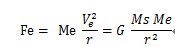
设置地球的速度变小或者变大时，地球的轨迹变成一个椭圆。

#### 运行修正后的程序：

设置地球的速度为2π AU / yr，  time step = 0.002 yr，观察地球运动三圈的轨迹，发现地球始终在远离太阳作近圆周运动，如下图所示。

* time step = 0.002 yr，

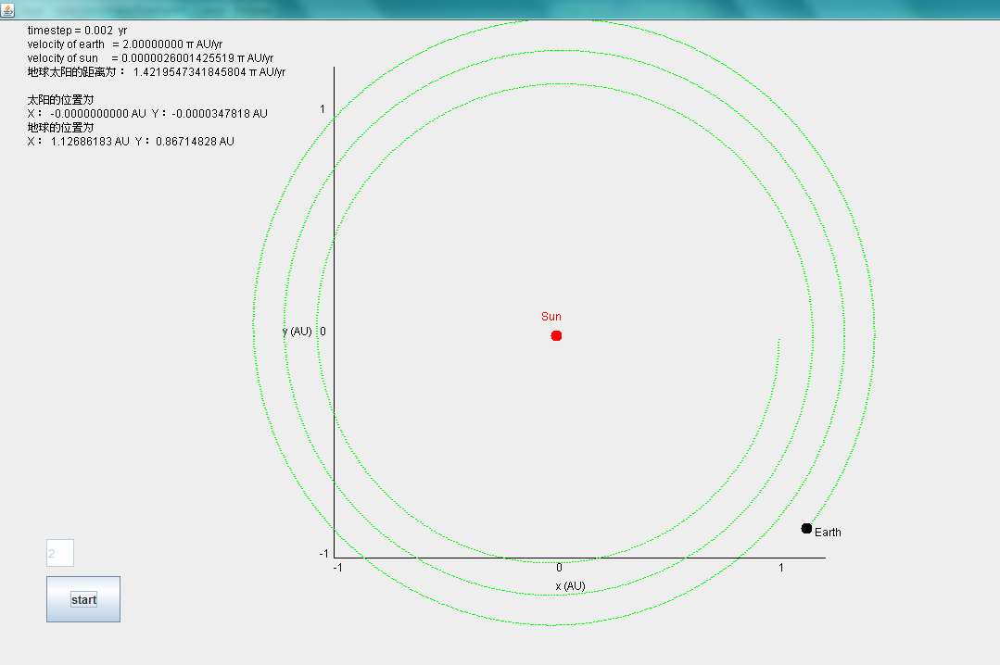
地球远离太阳作近似圆周的运动

* time step = 0.005 yr ，发现地球的轨迹相隔的距离减小。

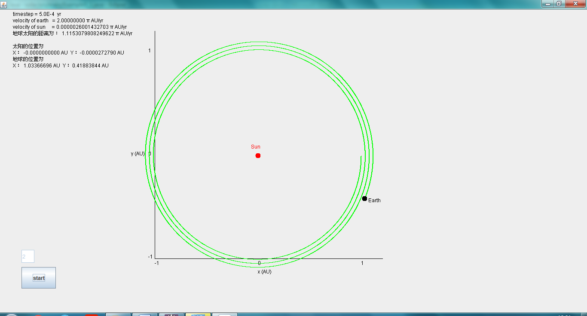
圆环的间隔减小

* timestep = 0.0001 yr，观察地球的运动和轨迹，与第一步使用 Euler-Cromer 方法得到的轨迹相近。

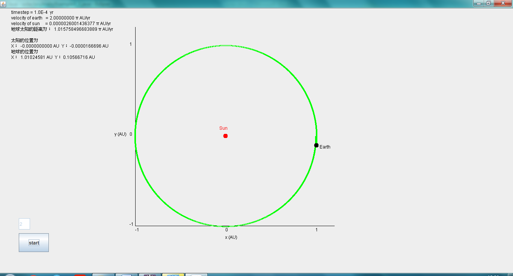
圆环之间几乎没有间隔

这就说明，用万有引力计算加速度，推导地球的运动速度，**时间间隔不能设置过大，否则地球的位移变化和速度变化不准确，导致轨迹错误**。只有当时间间隔非常小（0.0001 yr = 131.4 s）时，轨迹的计算才比较精确，如果设置时间间隔为 1s 或者更小的话，轨道和地球的速度将会更加精确。

之后设置不同的初速度观察，地球再进行第一圈的运动时，并不是一个稳定的状态，当转到第三圈时，能够看到地球的运动趋于稳定，这里的稳定是指，地球的轨道不再变化，而是保持和上一次的轨道轨迹。如右图所示，这时的地球正在进行第三圈的运动，发现第三次的轨迹和第二次的轨迹是完全一样的，证明 **地球的运动随着时间的变化逐渐趋于稳定**。

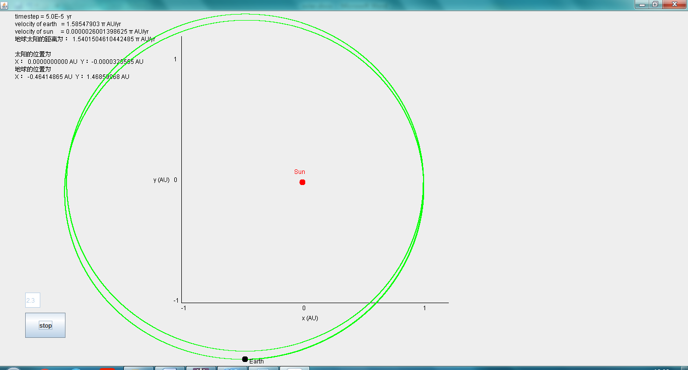

另外在这次的程序运行中，发现`太阳的速度和位移均不为0`，但是查看数值发现位移在 10-6 量级内，基本可以忽略。所以之前的 Euler-Cromer方法对于天体运动的近似完全正确。

## 总结：

    这次程序从课本出发，按照课本上所提供的算法和计算步骤，
    验证了
      1. Euler-Cromer 法则
      2. KEPLER 第二定律
      3. 根据已有的对于万有引力和加速度的知识，拓展了第三步的程序。
    理解到了，虽然公式正确，但是实验步骤和算法的细节对于结果的影响也是非常大的。
    错误的程序是因为错误的步骤和不精确的算法，只有仔细的 分析算法，理解步骤，
    才能够对程序和算法加以改进，合理的利用计算机进行科学运算，最终得到正确的结果。

